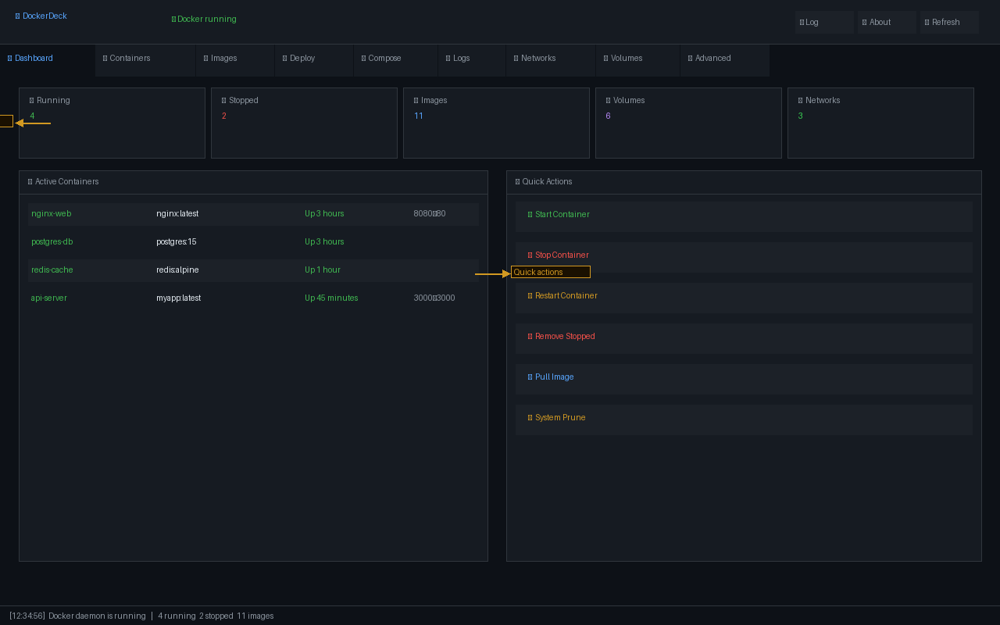
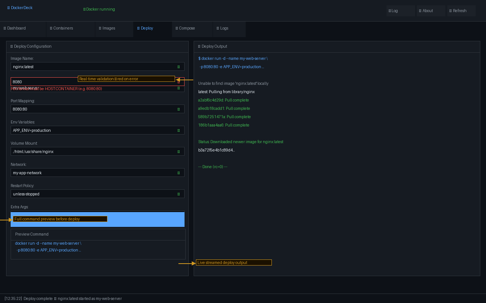
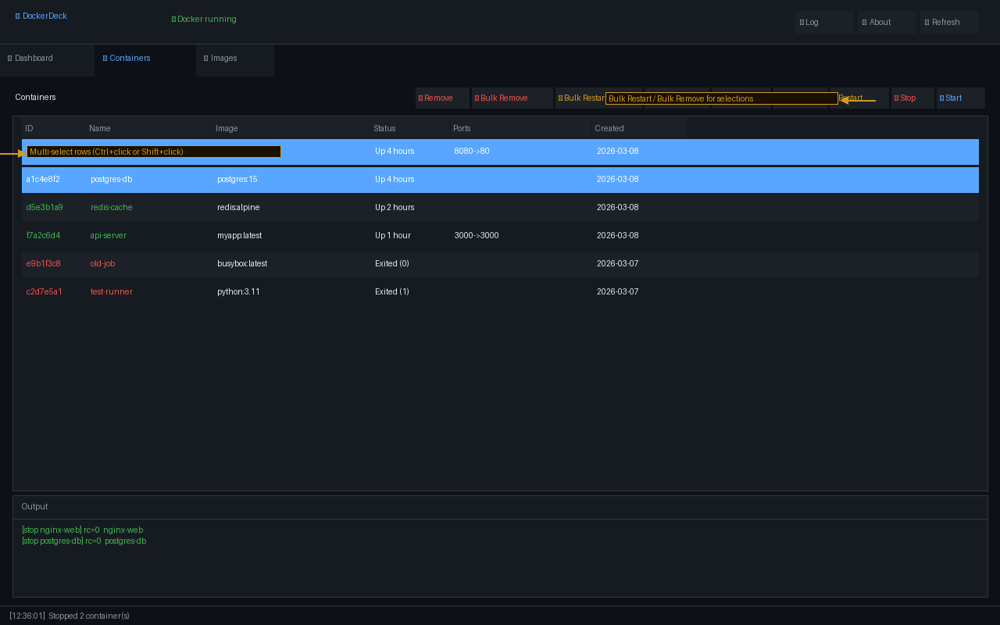
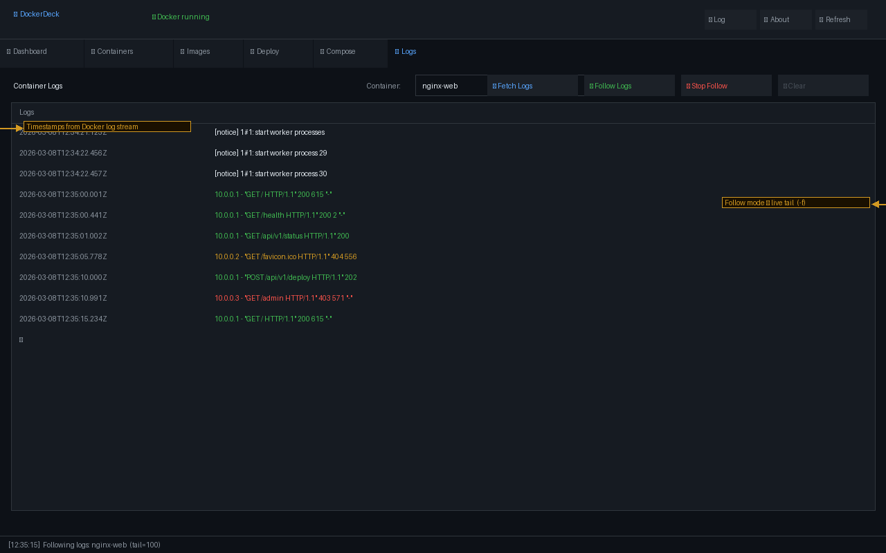
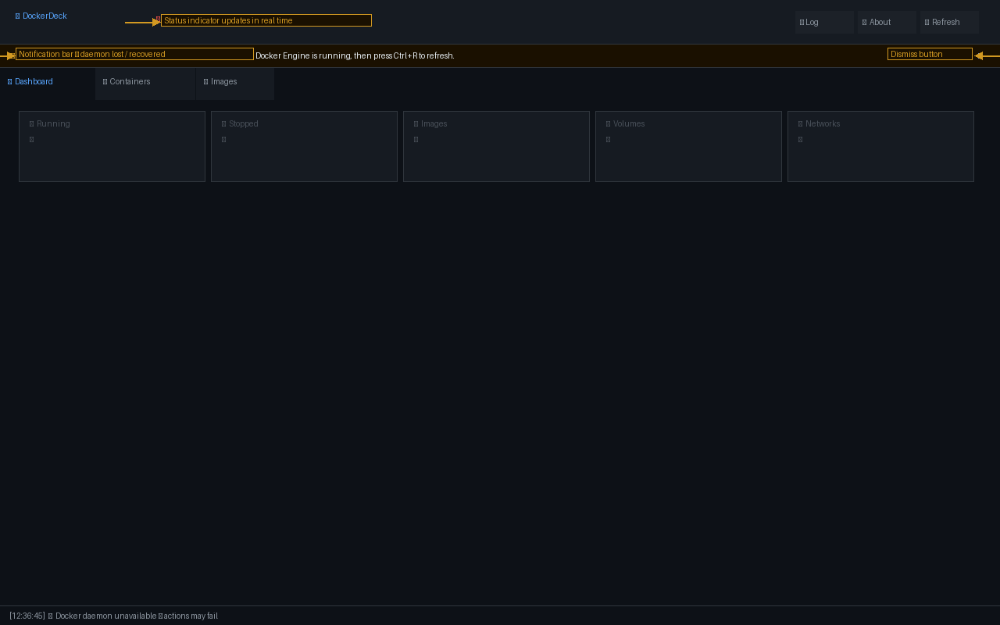
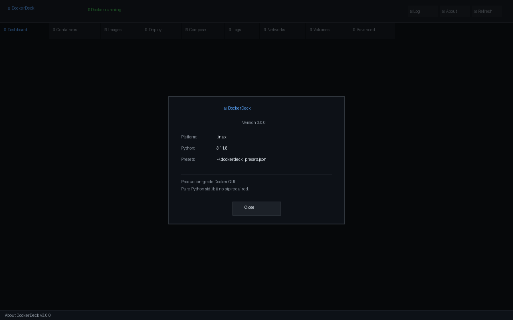

<!-- encoding: utf-8 -->
# DockerDeck v0.3.5

[](https://github.com/your-org/dockerdeck/actions/workflows/ci.yml)
[](LICENSE)
[](https://www.python.org/)

**Local Docker operator console** — manage containers, images, networks, volumes,
compose stacks, and registries from a single dark-themed desktop application.

**Scope:** DockerDeck is a personal/team local operator console — the clearest, safest way to run everyday Docker operations from a GUI. It is not a Docker Desktop replacement or a production deployment platform.

**Zero pip dependencies** -- pure Python 3.8+ stdlib (tkinter, subprocess, threading, json).

> Early stage -- feedback appreciated. Please open issues for bugs and feature requests.

---

## Screenshots

### Dashboard -- Real-time system overview



Live container counts, running stats, and quick-action buttons. All data
driven by `docker events` -- no polling.

### Deploy Tab -- with real-time field validation



Every field validates as you type (250ms debounce). Red indicator dots and
inline error messages appear immediately. Full command preview shown before
any `docker run` is executed.

### Containers -- Multi-select and bulk actions



Ctrl+click or Shift+click to select multiple containers. Bulk Restart and
Bulk Remove buttons act on the entire selection.

### Logs -- Live follow mode



Fetch a tail of recent logs or follow them live (`docker logs -f`).
Stop following at any time without closing the tab.

### Notification bar -- Daemon health monitoring



Background thread polls `docker info` every 12 seconds. When the daemon
goes offline, a notification banner appears automatically. When it recovers,
the banner clears and all views refresh.

### About dialog



---

## Quick Start

```bash
git clone https://github.com/your-org/dockerdeck.git
cd dockerdeck
python main.py
```

**Requirements:** Python 3.8+ with tkinter (stdlib).

| Platform | tkinter install |
|----------|-----------------|
| Ubuntu/Debian | `sudo apt install python3-tk` |
| Fedora/RHEL | `sudo dnf install python3-tkinter` |
| macOS | Use [python.org](https://python.org) installer (not Homebrew) |
| Windows | Tkinter ships with the standard Python installer |

---

## Project Structure

```
dockerdeck/
+-- main.py              # Entry point only
+-- app.py               # DockerDeck main window + all tab builders (UI only)
+-- docker_runner.py     # subprocess wrappers for Docker CLI
+-- validation.py        # Input validation & sanitisation (no tkinter)
+-- ui_components.py     # Reusable widget factories
+-- utils.py             # Thread helpers, debounce, notification log, constants
+-- actions/             # Business logic -- ZERO tkinter imports
|   +-- containers.py    # Container tab actions
|   +-- images.py        # Image tab actions
|   +-- deploy.py        # Deploy form + validation + presets
|   +-- network_volume.py# Network & Volume tab actions
|   +-- registry.py      # Registry login/push/pull (secure credentials)
+-- tests/
|   +-- test_validation.py       # 38 validation tests
|   +-- test_deploy.py           # 22 build_run_command / validate_field tests
|   +-- test_docker_runner.py    #  9 subprocess smoke tests (mocked)
|   +-- test_integration_smoke.py# 28 end-to-end workflow tests (mocked)
+-- docs/
|   +-- screenshots/             # 6 annotated UI screenshots
+-- .github/
|   +-- workflows/ci.yml         # CI: lint, test (3 OS x 3 Python), build
+-- dockerdeck.spec      # PyInstaller one-file build spec
+-- LICENSE              # MIT
+-- README.md
```

**Architecture rule:** `actions/`, `validation.py`, `docker_runner.py`, and `utils.py`
contain **zero tkinter imports** -- all business logic is fully testable without a display.
Only `app.py` and `ui_components.py` import tkinter.

---

## Running Tests

```bash
pip install pytest pytest-cov
cd dockerdeck
pytest tests/ -v --tb=short
```

Expected: **97 tests pass** in under 10 seconds (no Docker daemon, no display required).

```
tests/test_validation.py         38 tests
tests/test_deploy.py             22 tests
tests/test_docker_runner.py       9 tests
tests/test_integration_smoke.py  28 tests
TOTAL                            97 tests
```

---

## Building a Distributable Binary

```bash
pip install pyinstaller
pyinstaller dockerdeck.spec
```

Output: `dist/DockerDeck` (Linux/macOS) or `dist/DockerDeck.exe` (Windows).

| Platform | Notes |
|----------|-------|
| Windows  | Works with standard Python installer (tkinter bundled) |
| macOS    | Use python.org installer -- Homebrew Python lacks tkinter |
| Linux    | Install `python3-tk` before building |

> Cross-compilation is not supported by PyInstaller -- build on the target OS.

---

## Feature Reference

### Priority 1 -- Blockers (all resolved)

| # | Item | Status |
|---|------|--------|
| 1 | Monolithic god class split | done -- 7 modules + `actions/` package |
| 2 | `docker events` JSON stream | done -- targeted refresh per event type |
| 3 | Distributable binary | done -- `dockerdeck.spec` PyInstaller one-file build |
| 4 | Automated tests | done -- 97 pytest tests, zero Docker/display needed |

### Priority 2 -- Pre-release (all resolved)

| # | Item | Status |
|---|------|--------|
| 5 | Real-time field validation | done -- KeyRelease + FocusOut, red dots + error labels |
| 6 | Persistent notification log | done -- deque(200) + "Log" viewer in header |
| 7 | Daemon health monitoring | done -- 12s poll, banner on loss, auto-recover |
| 8 | Version / update check | done -- GitHub API on startup, toast notification |
| 9 | Password zeroing | done -- ctypes.memset + del + GC after communicate |

### Priority 3 -- Polish (all resolved)

| Item | Status |
|------|--------|
| Debounce (250ms) on keystrokes | done |
| Copy command / output to clipboard | done -- Deploy + Terminal panes |
| First-run wizard (Docker missing) | done -- install links dialog |
| Ctrl+R / F5 global refresh | done |
| WCAG AA contrast (text_disabled 4.94:1) | done |
| Keyboard focus rings on all interactive elements | done |
| Bulk Restart / Bulk Remove | done |
| GitHub Actions CI (lint + test + build) | done |
| MIT LICENSE | done |
| Annotated screenshots | done -- 6 screenshots in docs/ |

---

## Security Notes

- Registry passwords are **never** passed as CLI arguments -- piped via `--password-stdin` only
- Password entry widget is **wiped immediately** before the background thread starts
- After `communicate()`, password bytes are overwritten with `ctypes.memset` and deleted
- All deploy fields validated against a **strict allowlist** before any subprocess call
- A **confirmation dialog with full command preview** is shown before every `docker run`
- `validate_extra_args` permits only known-safe flags (explicit allowlist)

---

## Accessibility

- All interactive widgets have visible **keyboard focus rings** (WCAG 2.1 SC 2.4.7)
- Text contrast ratios verified against WCAG AA (4.5:1 minimum):
  - `text_primary` on dark background: 16.0:1 (AAA)
  - `text_secondary` on dark background: 6.15:1 (AA)
  - `text_disabled` on dark background: 4.94:1 (AA) -- corrected from 4.12 in v3.0
  - Status colours (green/red/orange) all exceed 5:1
- `text_dim` (#484f58) used **only** for decorative elements (separators, placeholder dots)
  -- never for readable text content

---

## Tested Platforms

| Platform | Version | Python | Status |
|----------|---------|--------|--------|
| Windows 11 | 23H2 | 3.11 | Tested -- all tabs functional |
| macOS 15 (Sequoia) | -- | 3.12 | Tested -- python.org installer required |
| Ubuntu 24.04 LTS | -- | 3.11, 3.12 | Tested -- requires python3-tk |

### Known Limitations

| Platform | Limitation | Workaround |
|----------|-----------|------------|
| Windows | `docker exec -it` shell requires separate terminal | Copy the command from "Shell Cmd" button |
| macOS (Homebrew Python) | tkinter may be missing | Use python.org installer |
| Linux (Wayland) | Some window focus issues on certain compositors | Run with `GDK_BACKEND=x11` if needed |
| All | No tray icon / minimize-to-tray | Planned for v4 |
| All | Compose syntax not highlighted | Planned for v4 |

---

## Keyboard Shortcuts

| Key | Action |
|-----|--------|
| `Ctrl+R` | Refresh all views |
| `F5` | Refresh all views |
| `Enter` | Submit input dialogs |

---

## Presets

Deploy configurations are saved to `~/.dockerdeck_presets.json`.
Use Save / Load / Delete buttons in the Deploy tab.

---

## License

MIT -- see [LICENSE](LICENSE).
